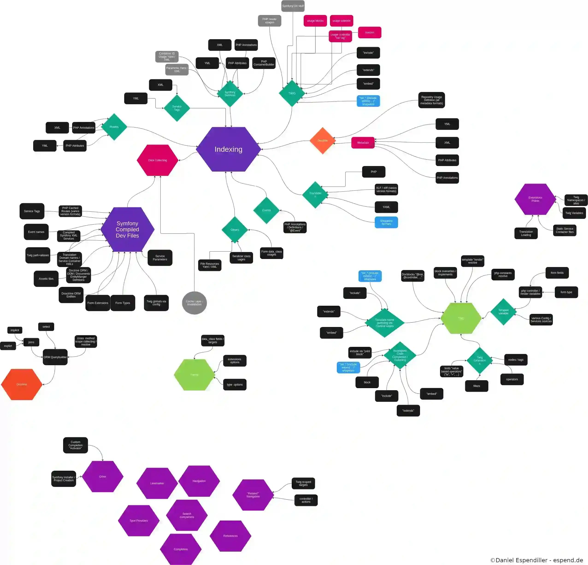

IntelliJ IDEA / PhpStorm Symfony Plugin
========================

| Key                  | Value                                     |
|----------------------|-------------------------------------------|
| Plugin Url           | https://plugins.jetbrains.com/plugin/7219 |
| ID                   | fr.adrienbrault.idea.symfony2plugin       |
| Documentation        | https://espend.de/phpstorm/plugin/symfony |
| Changelog            | [CHANGELOG](CHANGELOG.md)                 |
| Build and Deployment | [MAINTENANCE](MAINTENANCE.md)             |

Install
---------------------
* Install the plugin by going to `Settings -> Plugins -> Browse repositories` and then search for `Symfony`.
* Enabled it per project (File -> Settings -> Languages & Framework -> PHP -> Symfony)
* Install [Php Annotation](http://plugins.jetbrains.com/plugin/7320) plugin to enjoy all the annotation stuff
* Plugin needs a valid PhpStorm indexer, use "File > Invalidate Caches / Restart" if something crazy is going on

Freemium
---------------------

Since PhpStorm 2022.1 this plugin is marked a "Freemium".

* All features which are inside [GitHub](https://github.com/Haehnchen/idea-php-symfony2-plugin) are free to use, unless there is reason (e.g. Supporting old Symfony Version, ...) 
* Non-free features are flagged with _[paid]_ inside [Documentation](https://espend.de/phpstorm/plugin/symfony) and inside the [CHANGELOG](https://github.com/Haehnchen/idea-php-symfony2-plugin/blob/master/CHANGELOG.md)  
* There is ~15min grace period after project opening where all features are available
* A license must be activated via PhpStorm / Intellij: use menu "Help -> Register" or use "Search Everywhere" by searching for "Manage License..." action 

_A license can be bought at [JetBrains Marketplace](https://plugins.jetbrains.com/plugin/7219-symfony-support/pricing)_

Version
---------------------

* This plugin supports Symfony 2, 3, 4, ...

Documentation and tutorials
---------------------

* Documentation / Feature List [read online](https://espend.de/phpstorm/plugin/symfony)
* JetBrains: [Symfony Development using PhpStorm](https://confluence.jetbrains.com/display/PhpStorm/Symfony+Development+using+PhpStorm)
* KnpUniversity: [Lean and Mean Dev with PhpStorm (for Symfony)](https://knpuniversity.com/screencast/phpstorm)
* Slides: [PhpStorm: Symfony2 Plugin](https://www.slideshare.net/Haehnchen/phpstorm-symfony2-plugin)

Autocomplete (or something else) is not working! Help! :open_mouth:
-------------------------------------------------------------------

* You usually need to trigger the autocomplete popup yourself, by pressing CTRL+SPACE (maybe a different shortcut depending on your keymap).
* Check your File -> Settings -> PHP -> Symfony -> Enable Plugin for this Project

Technical Diagram (Work In Progress)
--------------------

Building, debugging and other
--------------------

* Install IntelliJ IDEA (Community Edition works fine)
* Open this project
* Choose `View > Tool Windows > Gradle`
* Double click `idea-php-symfony2-plugin > Tasks > intellij > runIde`

If you are having difficulties, consult the documentation: http://confluence.jetbrains.com/display/PhpStorm/Setting-up+environment+for+PhpStorm+plugin+development

* Want to sponsor my development? Nice! You can sponsor me via [PayPal](https://www.paypal.com/cgi-bin/webscr?cmd=_s-xclick&hosted_button_id=5ZTGW6H4Y7MT8) or [Github](https://github.com/sponsors/Haehnchen). Github matches your donation so the total donation will be doubled. 

What? Something still does not work? Damn! :cry:
------------------------------------------------

You can browse the existing issues at https://github.com/Haehnchen/idea-php-symfony2-plugin/issues

If your issue already exists, don't hesitate to add a comment to help contributors resolve the issue more easily.
If your issue does not exist, open a new issue :smiley:.

Make sure to provide the maximum amount of information, such as:
* What version of PhpStorm are you using?
* What version of the plugin are you using?
* The stack trace if an error occurred
* Check if you are in PhpStorm eap channel
